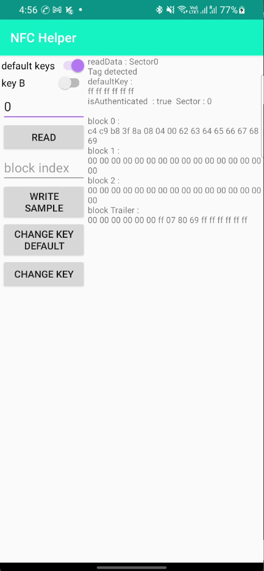

# Project Title

A android sample project for NFC mifareclassic card

## Features

- authentication with key A and key B
- read sector data
- write test data in block
- change sector keys (trailer block data)

## Screenshots

## Documentation

[MIFARE Classic ](https://www.nxp.com/docs/en/data-sheet/MF1S50YYX_V1.pdf) 

[Android MifareClassic ](https://developer.android.com/reference/android/nfc/tech/MifareClassic)

